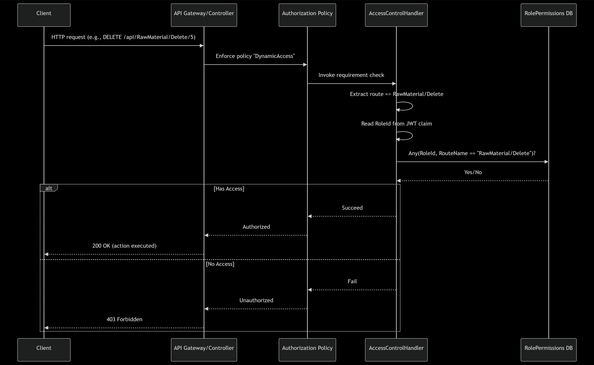

<!-- New-NetFirewallRule -DisplayName "SQL Server TCP 1433" -Direction Inbound -Action Allow -Protocol TCP -LocalPort 1433 -Profile Any -->

# Backend API Architecture

```
Controller = WHAT (API)
Service    = HOW (Logic)
Repo       = FROM WHERE (DB)
DTO        = IN WHAT SHAPE

HTTP Request
   ↓
Controller
   ↓ calls
Service
   ↓ calls
Repository
   ↓ uses
DbContext
   ↓
Database
   ↑
Entity
   ↑
Service (Entity → DTO mapping)
   ↑
Controller
   ↑
HTTP Response (DTO)

--- RELATIONSHIPS ---
modelBuilder.Entity<ChildTable>()
         .HasOne(child => child.ParentNavigation)
         .WithMany(parent => parent.ChildrenCollection)
         .HasForeignKey(child => child.ParentIdField);

INSERT INTO RolePermissions (RoleId, RouteName) VALUES (2, 'RawMaterial/Delete');
```


